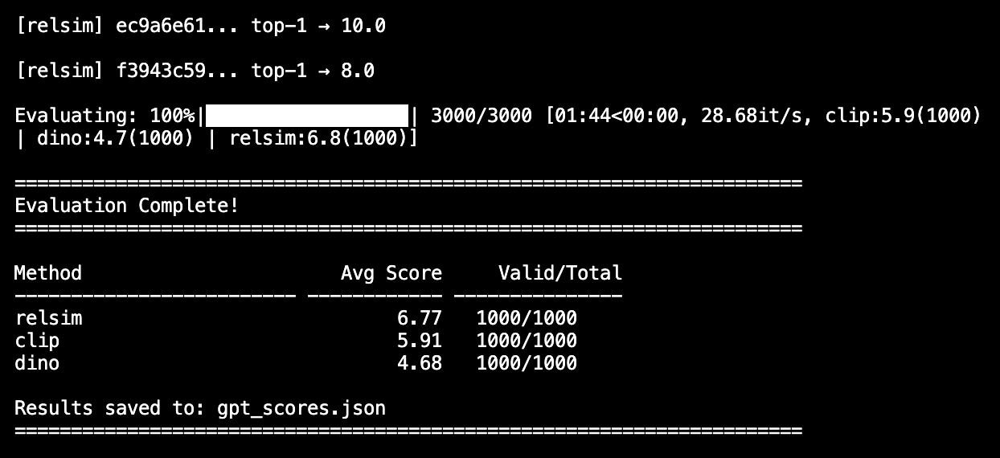
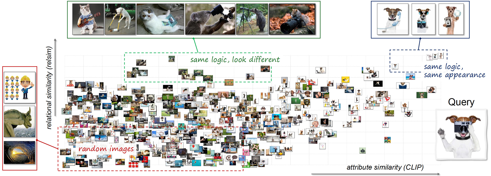

#  [Relational Visual Similarity](https://thaoshibe.github.io/relsim/)

<p align="left">
  <a href="https://arxiv.org/abs/2512.07833"></a>
  <a href="#citation"></a>
  <a href="https://huggingface.co/datasets/thaoshibe/anonymous-captions-114k"></a>
  <a href="https://huggingface.co/thaoshibe/relsim-qwenvl25-lora"></a>
  <a href="https://thaoshibe.github.io/relsim/"></a>
  <a href="https://thaoshibe.github.io/relsim/data_viewer/index.html"></a>
  <a href="https://thaoshibe.github.io/relsim/retrieve/index.html"></a>
  <a href="https://github.com/thaoshibe/relsim/stargazers"></a>
</p>

<!-- | |
|:--|
| *We introduce a new visual similarity notion — relational visual similarity (relsim) — which captures the internal relational logic of a scene rather than its surface appearance.* | -->

<table>
  <tr>
    <td></td>
    <td><a href="https://thaoshibe.github.io/relsim/"><b>Relational Visual Similarity</b></a> (arXiv 2025) <br> <a href="https://thaoshibe.github.io/">Thao Nguyen</a><sup>1</sup>, <a href="https://sichengmo.github.io/">Sicheng Mo</a><sup>3</sup>, <a href="https://krsingh.cs.ucdavis.edu/">Krishna Kumar Singh</a><sup>2</sup>, <a href="https://yilinwang.org/">Yilin Wang</a><sup>2</sup>, <a href="https://jshi31.github.io/jingshi/">Jing Shi</a><sup>2</sup>, <a href="https://scholar.google.com/citations?user=MqWYTj0AAAAJ&hl=en">Nicholas Kolkin</a><sup>2</sup>, <a href="https://scholar.google.com/citations?user=B_FTboQAAAAJ&hl=en">Eli Shechtman</a><sup>2</sup>, <a href="https://pages.cs.wisc.edu/~yongjaelee/">Yong Jae Lee</a><sup>1,2, ★</sup>, <a href="https://yuheng-li.github.io/">Yuheng Li</a><sup>1, ★</sup> <br>(★ Equal advising) <br> 1- University of Wisconsin–Madison;  2- Adobe Research;  3- UCLA</td>
  </tr>
</table>

> TL;DR: We introduce a new visual similarity notion: **relational visual similarity**, which complements traditional **attribute-based perceptual similarity** (e.g., LPIPS, CLIP, DINO).

<details>
<summary> Click here to read <b>Abstract 📝</b></summary>
Humans do not just see attribute similarity---we also see relational similarity. An apple is like a peach because both are reddish fruit, but the Earth is also like a peach: its crust, mantle, and core correspond to the peach’s skin, flesh, and pit. This ability to perceive and recognize relational similarity, is arguable by cognitive scientist to be what distinguishes humans from other species.
Yet, all widely used visual similarity metrics today (e.g., LPIPS, CLIP, DINO) focus solely on perceptual attribute similarity and fail to capture the rich, often surprising relational similarities that humans perceive.
How can we go beyond the visible content of an image to capture its relational properties? How can we bring images with the same relational logic closer together in representation space?
To answer these questions, we first formulate relational image similarity as a measurable problem: two images are relationally similar when their internal relations or functions among visual elements correspond, even if their visual attributes differ.
We then curate 114k image–caption dataset in which the captions are anonymized---describing the underlying relational logic of the scene rather than its surface content. Using this dataset, we finetune a Vision–Language model to measure the relational similarity between images. This model serves as the first step toward connecting images by their underlying relational structure rather than their visible appearance.
Our study shows that while relational similarity has a lot of real-world applications, existing image similarity models fail to capture it---revealing a critical gap in visual computing.
</details>
---

🔗 Table of Content:
1. [🛠️ Quick Usage](#usage)
1. [🫥 Anonymous Captioning Model](#anonymousmodel)
1. [📁 Dataset](#data) | [live view](https://thaoshibe.github.io/relsim/data_viewer/index.html)
1. [🔄 Image Retrieval](#retrieval) | [live view](https://thaoshibe.github.io/relsim/retrieve/index.html)
1. [📄 BibTeX](#citation)

---

# 🛠️ Quick Usage <a name="usage"></a>

This code is tested on Python 3.10: (i) **NVIDIA A100 80GB** (torch2.5.1+cu124) and (ii) **NVIDIA RTX A6000 48GB** (torch2.9.1+cu128).
<br>
Other hardware setup hasn't been tested, but it should still work. Please install pytorch and torchvision according to your machine configuration.
> You can also found `relsim` via HuggingFace: [🤗 thaoshibe/relsim-qwenvl25-lora](https://huggingface.co/thaoshibe/relsim-qwenvl25-lora)

```bash
conda create -n relsim python=3.10
pip install relsim

# or you can clone the repo
git clone https://github.com/thaoshibe/relsim.git
cd relsim
pip install -r requirements.txt
```

Given two images, you can compute their relational visual similarity (relsim) like this:

```python
from relsim.relsim_score import relsim
from PIL import Image

# Load model
model, preprocess = relsim(pretrained=True, checkpoint_dir="thaoshibe/relsim-qwenvl25-lora")

img1 = preprocess(Image.open("image_path_1"))
img2 = preprocess(Image.open("image_path_2"))
similarity = model(img1, img2)  # Returns similarity score (higher = more similar)
print(f"relational similarity score: {similarity:.3f}")
```

Or you can run [`python test.py`](test.py) for a quick test. Here is example results. All below images can be found in [this folder](./anonymous_caption/):
| reference image | test image 1  | test image 2 | test image 3 | test image 4 | test image 5 | test image 6 |
|--------------|-----------------|------------|------------|------------|------------|------------|
|  |  |   |  |  |  |  |
|  (to itself: 1.000) | 0.981 | 0.830 | 0.808 | 0.767 | 0.465 | 0.223 | 

<!-- Or another image set:

| reference image | test image 1  | test image 2 | test iamge 3 | test iamge 4 |
|--------------|-----------------|------------|------------|------------|
|  |   |  |  |  |
|  (to itself: 1.000) | 0.981 | 0.808 | 0.767 | 0.214| -->


---
🤗 You're welcome to improve the current relsim model! The training code is provided in [./relsim/train.sh](./relsim/train.sh) folder. For a quick jump to the training script: <br>
*(Reminder: you might need to download data [here](#data) first to run this training code sucessfully)*

```bash
git clone https://github.com/thaoshibe/relsim.git
cd relsim/relsim
pip install -r requirements_train.txt
bash train.sh # this assume you have the dataset alrerady

### you might want to export WANDB and HF_TOKEN
# export WANDB_API_KEY='your_wandb_api_key'
# export HF_TOKEN='your_hf_token'
```

<details>
<summary> Click here to see example of wandb log</summary>

</details>

---

# 🫥 Anonymous Caption Model <a name="anonymousmodel"></a>

> *Anonymous captions are image captions that do not refer to specific visible objects but instead capture the relational logic conveyed by the image.*

The pretrained anonymous caption model (Qwen-VL-2.5 7B) is provided in [./anonymous_caption](./anonymous_caption/).
This model is trained on a limited number of seed groups and their corresponding generated captions (see the training data [here](https://thaoshibe.github.io/relsim/data_viewer/seed_groups.html)).

```bash
# run on default test image (mam.jpg)
python anonymous_caption/anonymous_caption.py

# run on your own images
python anonymous_caption/anonymous_caption.py --image_path $PATH_TO_IMAGE_OR_IMAGE_FOLDER

# if you need to see all arguments (e.g., batch size)
python anonymous_caption/anonymous_caption.py --help
```

Here is example of the generated anonymous captions with different runs.
| Input image | Generated anonymous captions (Different run) |
|-----|-------|
|  | Example: `python anonymous_caption/anonymous_caption.py --image_path anonymous_caption/mam.jpg`<br>Run 1: "Curious {Animal} peering out from behind a {Object}."<br> Run 2: "Curious {Animal} peeking out from behind the {Object} in an unexpected and playful way."<br> Run 3: "Curious {Cat} looking through a {Doorway} into the {Room}."<br> Run 4: "A curious {Animal} peeking from behind a {Barrier}."<br> Run 5: "A {Cat} peeking out from behind a {Door} with curious eyes."<br>... |
|  | Example: `python anonymous_caption/anonymous_caption.py --image_path anonymous_caption/bo.jpg`<br>Run 1: "Animals with {Leaf} artfully placed on their {Head}."<br> Run 2: "A {Dog} with a {Leaf} delicately placed on its head."<br> Run 3: "A {Dog} with a {Leaf} artfully placed on its head."<br> Run 4: "A {Dog} with a {Leaf} delicately placed on their head, representing the beauty of {Season}."<br> Run 5: "Animals adorned with {Leaf} in a {Seasonal} setting."<br> ...| 

> 🤗 You are more than welcome to help improve the anonymous caption model! The current model may hallucinate or produce incorrect results, and sometimes it may generate captions that are not "anonymous enough", etc.

The training script for the anonymous caption model is shown below.
Please check [config.yaml](./anonymous_caption/config.yaml) for config details.

```bash
#########################################
#
#     train anonymous caption model 
#
#########################################

# install git lfs if you don't have
sudo apt update
sudo apt install git-lfs
git lfs install

# clone repo if you haven't do that yet
git clone https://github.com/thaoshibe/relsim.git

# download the training data
cd relsim/anonymous_caption
git clone https://huggingface.co/datasets/thaoshibe/seed-groups
pip install -r requirements.txt
# run train
python anonymous_caption_train.py
```

<details>
<summary> Click here to see example of wandb log. Checkpoints will be saved in `./anonymous_caption/ckpt`.*</summary>
<br>
<br>
And your console should look like this:
<br>

</details>

---
# 📁 Data <a name="data"></a>

> **🔍 You can see the snapshot of the data on this live website: [🔍🔍🔍 relsim: data viewer](https://thaoshibe.github.io/relsim/data_viewer/index.html)**

| Dataset name | Short description  | JSON file | 🔍 Data viewer |
|--------------|-----------------|------------|------------|
| seed-groups <a href="https://huggingface.co/datasets/thaoshibe/seed-groups"></a> | Use to train the anonymous captioning model | [seed_group.json](./data/seed_group.json) | [See Seed Groups Dataset](https://thaoshibe.github.io/relsim/data_viewer/seed_groups.html) |
| anonymous-captions-114k <a href="https://huggingface.co/datasets/thaoshibe/anonymous-captions-114k"></a> | Use to train the relational similarity model | [anonymous_captions_train.jsonl](./data/anonymous_captions_train.jsonl), [anonymous_captions_test.jsonl](./data/anonymous_captions_test.jsonl)| [See Anonymous Captions Dataset](https://thaoshibe.github.io/relsim/data_viewer/anonymous_captions.html) |

Each image will be given by their corresponding Image URL. Please see the json files in [./data](./data).
<br>
<br> (Optional) Depending on your internet speed, it should take under 0.5 hours to download all images with the default MAX_WORKER = 64.
You can increase MAX_WORKER to speed up the download or reduce it depending on your internet (see the [data/download_data.sh](./data/download_data.sh))

To download, please run this the [data/download_data.sh](./data/download_data.sh)

```bash
#########################################
#
#            download data
#
#########################################

git clone https://github.com/thaoshibe/relsim.git
cd relsim
bash data/download_data.sh # this script will download all dataset
```

---
# 🔄 Image Retrieval <a name="retrieval"></a>

You might want to build an image retrieval system.  
A snapshot of how to do that is provided in [./retrieval/](./retrieval/), along with the GPT-4o scoring code (to evaluate top-k retrieval). The provided databases are [14k-test-set](./data/anonymous_captions_test.jsonl) and [14k random images](./data/random_images_14k.jsonl) from LAION. Here, we combined them for the convenience of the code into [combined.jsonl](./retrieval/combined.jsonl).  
The full code can be found in [./retrieval/pipeline.sh](./retrieval/pipeline.sh).

```bash
cd retrieval

# precompute the embedding for each image
python get_embedding_our.py \
    --checkpoint_dir thaoshibe/relsim-qwenvl25-lora \
    --json_file combined.jsonl \
    --output_path ./precomputed/relsim.npz \
    --batch_size 16

# perform retrieval
python retrieve_topk_images.py \
    --precomputed_dir ./precomputed \
    --output_file retrieved_images.json \
    --topk 10 \
    --num_images 1000 \
    --image_dir ./images
```

An example of retrieved_images.json are provided in [./retrieval/retrieved_images.json](./retrieval/retrieved_images.json).
You can also see the **uncurated 1000 retrieved results** live at [🔍 Image Retrieval Results | LIVE!!!](https://thaoshibe.github.io/relsim/retrieve/index.html).

(Optional) If you want to use GPT-4o to evaluate the results, please put your GPT-4o API key in [./retrieval/gpt4o_config.yaml](./retrieval/gpt4o_config.yaml). Then run the GPT-4o evaluation code at the bottom of this file: [./retrieval/pipeline.sh](./retrieval/pipeline.sh). GPT-4o's answers may vary between sessions.

<details>
<summary>Click here to see one example snapshot of the GPT-4o score</summary>


</details>

---
# 📊 Similarity Space Figure

You might not believe it, but yes, we spent months+++ figuring out how to plot this theorical **Similarity Space** (Figure 7 in main paper).  
So I won't let that effort go to waste! Code for the figures in this paper is available in [./plot_figure/](./plot_figure/).

<table>
  <tr>
    <td><a href="https://scholar.google.com/citations?view_op=view_citation&hl=en&user=JQ2VugwAAAAJ&citation_for_view=JQ2VugwAAAAJ:2osOgNQ5qMEC"></a></td>
    <td></td>
  </tr>
</table>

Left: *Similarity Space* figure---in Cognitive Science theory, published with the *phenomenal* 1997 paper: ["Structure Mapping in Analogy and Similarity"](https://scholar.google.com/citations?view_op=view_citation&hl=en&user=JQ2VugwAAAAJ&citation_for_view=JQ2VugwAAAAJ:2osOgNQ5qMEC) (Dedre Gentner and Arthur B. Markman).
<br> Right: *Similarity Space* figure---in Computer Science~ yes, after almost 30 years, we finally can replicate the theorical figure, with [Relational Visual Similarity](https://thaoshibe.github.io/relsim) paper.

Cool, isn't it??
(˵ •̀ ᴗ - ˵ ) ✧

---
## ⚠️ Disclaimer
> All images are extracted from [LAION](https://laion.ai/) dataset. We do **NOT** own any of the images and we acknowledge the rights and contributions of the original creators. Please respect the authors of all images. These images are used for **research purposes only**.

---
## 📄 BibTeX <a name="citation"></a>

<!-- ```bibtex
@article{nguyen2025relsim,
  title={Relational Visual Similarity},
  author={Nguyen, Thao and Mo, Sicheng and Singh, Krishna Kumar and Wang, Yilin and Shi, Jing and Kolkin, Nicholas and Shechtman, Eli and Lee, Yong Jae and Li, Yuheng},
  journal={arXiv preprint arXiv:XXXX.XXXXX},
  year={2025}
}
``` -->
```bibtex
@misc{nguyen2025relationalvisualsimilarity,
      title={Relational Visual Similarity}, 
      author={Thao Nguyen and Sicheng Mo and Krishna Kumar Singh and Yilin Wang and Jing Shi and Nicholas Kolkin and Eli Shechtman and Yong Jae Lee and Yuheng Li},
      year={2025},
      eprint={2512.07833},
      archivePrefix={arXiv},
      primaryClass={cs.CV},
      url={https://arxiv.org/abs/2512.07833}, 
}
```

---
You've reached the end (.❛ ᴗ ❛.).
<br>(ˆڡˆ)◞🍪
<br>🍪 here is a cookie for you~
<br>Enjoy and consider giving me a star ⭐~ Thank you [](https://github.com/thaoshibe/relsim)
