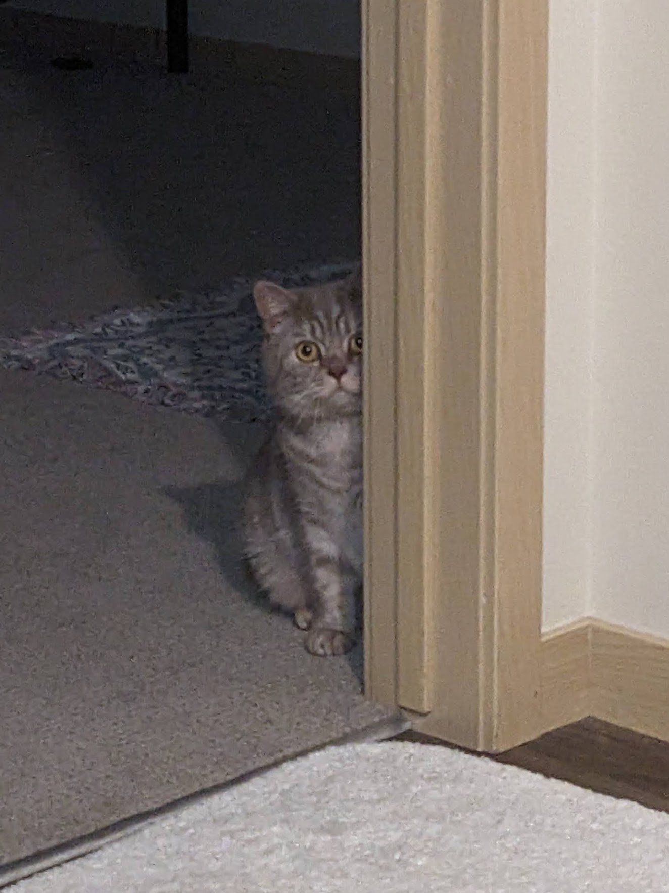
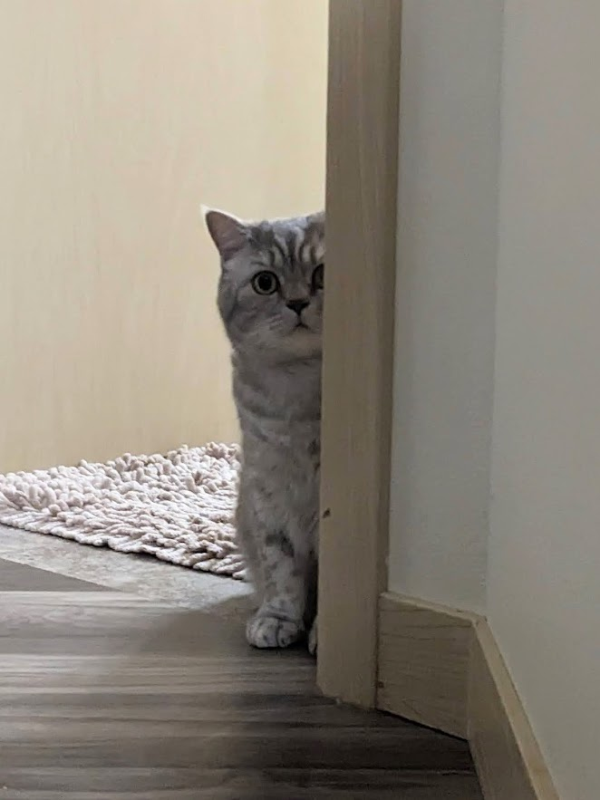
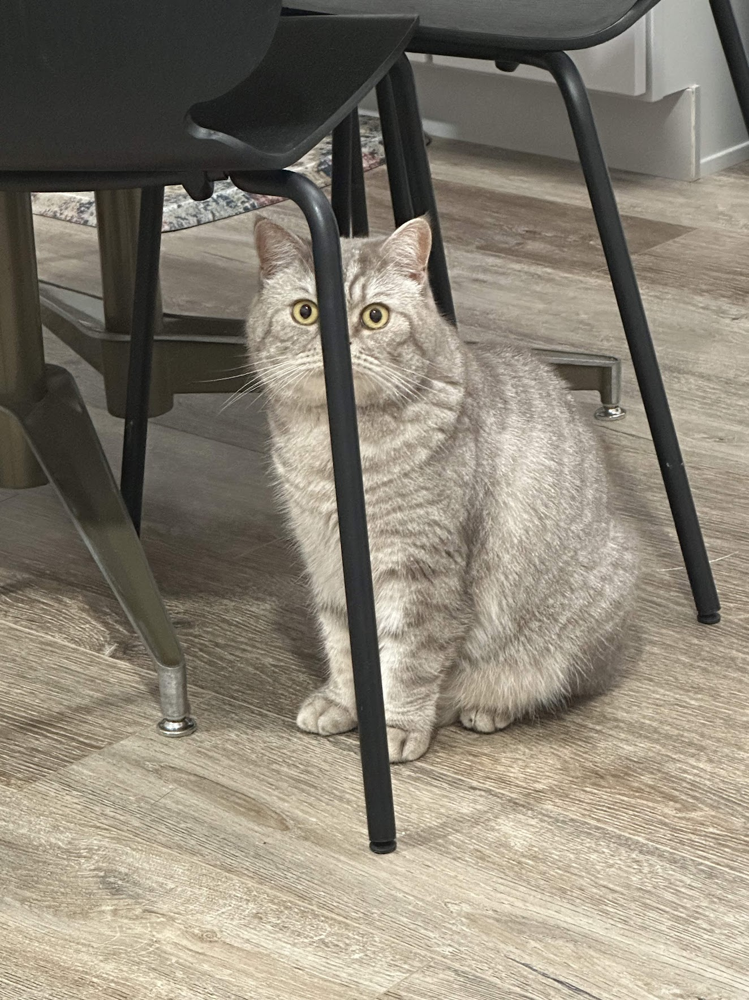
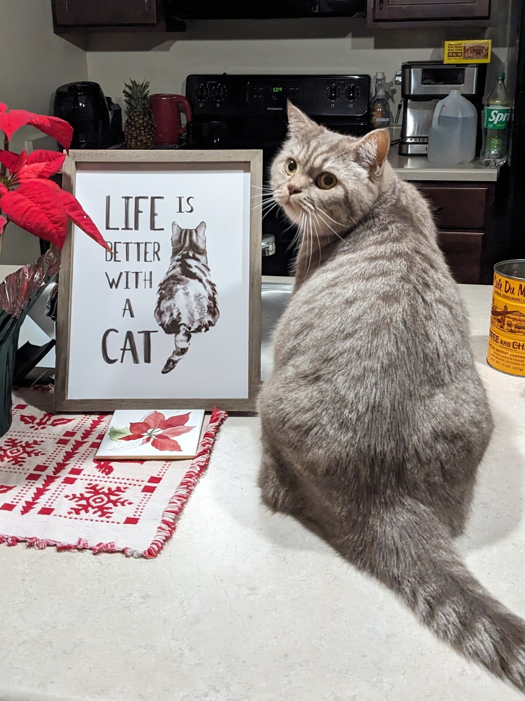
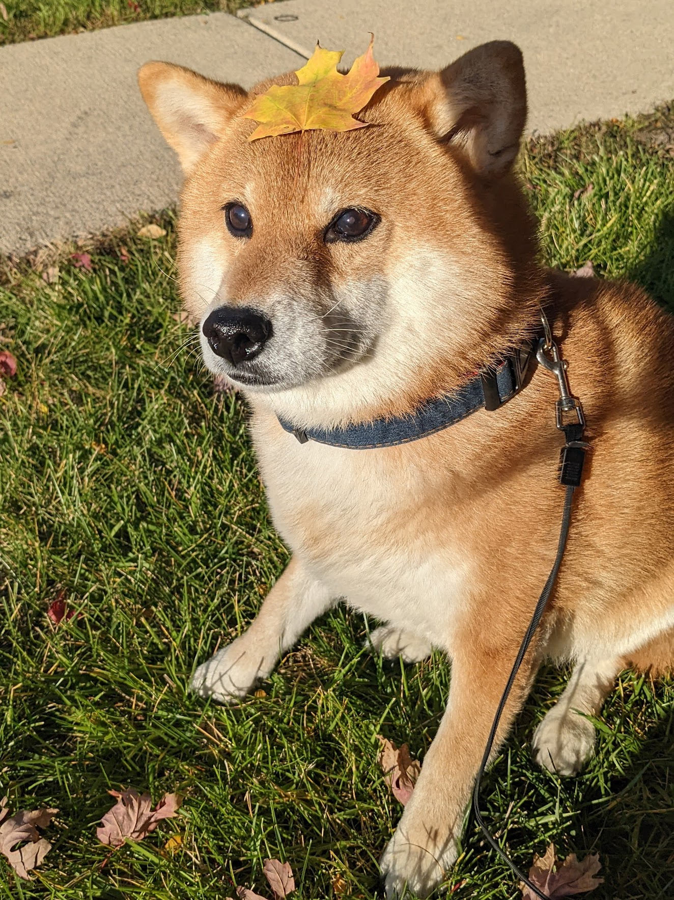
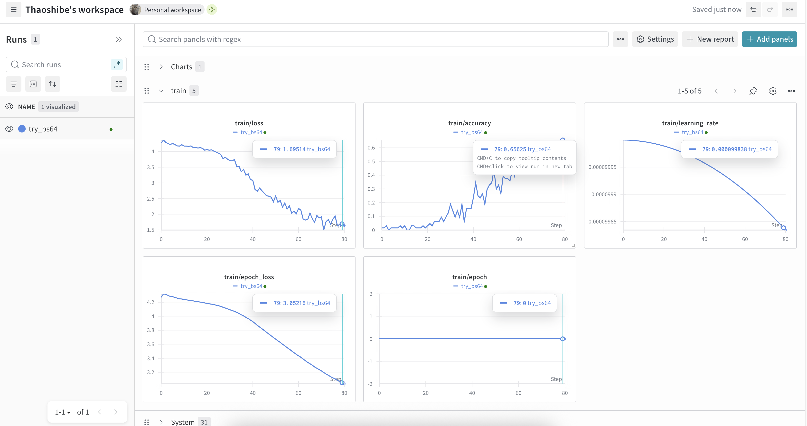
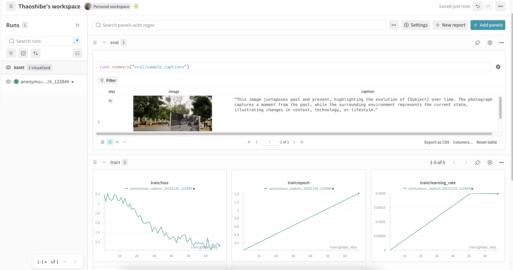
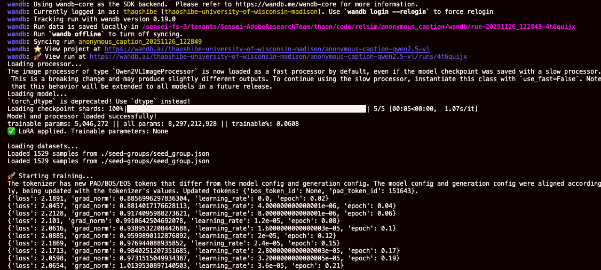

# relsim

<p align="left">
  <a href="PUT_ARXIV_LINK_HERE"></a>
  <a href="#citation"></a>
  <a href="https://huggingface.co/datasets/thaoshibe/anonymous-captions-114k"></a>
  <a href="https://thaoshibe.github.io/relsim/"></a>
  <a href="https://thaoshibe.github.io/relsim/data_viewer/index.html"></a>
  <a href="https://thaoshibe.github.io/relsim/retrieve/index.html"></a>
  <a href="https://github.com/thaoshibe/relsim/stargazers"></a>
</p>

|  |
|:--:|
| *We introduce a new visual similarity notion — relational visual similarity (relsim) — which captures the internal relational logic of a scene rather than its surface appearance.* |

[**Relational Visual Similarity**](https://thaoshibe.github.io/relsim/) (arXiv 2025)  
[Thao Nguyen](https://thaoshibe.github.io/)<sup>1</sup>, [Sicheng Mo](https://sichengmo.github.io/)<sup>3</sup>, [Krishna Kumar Singh](https://krsingh.cs.ucdavis.edu/)<sup>2</sup>, [Yilin Wang](https://yilinwang.org/)<sup>2</sup>, [Jing Shi](https://jshi31.github.io/jingshi/)<sup>2</sup>, [Nicholas Kolkin](https://scholar.google.com/citations?user=MqWYTj0AAAAJ&hl=en)<sup>2</sup>, [Eli Shechtman](https://scholar.google.com/citations?user=B_FTboQAAAAJ&hl=en)<sup>2</sup>, [Yong Jae Lee](https://pages.cs.wisc.edu/~yongjaelee/)<sup>1,2, ★</sup>, [Yuheng Li](https://yuheng-li.github.io/)<sup>1, ★</sup>
<br>(★ Equal advising)
<br> 1- University of Wisconsin–Madison | 2- Adobe Research | 3- UCLA

> TL;DR: We introduce a new visual similarity notion: **relational visual similarity**, which complements traditional **attribute-based perceptual similarity** (e.g., LPIPS, CLIP, DINO).

---

🔗 Jump to:
1. [🛠️ Quick Usage](#usage)
1. [🫥 Anonymous Captioning Model](#anonymousmodel)
1. [📁 Dataset](#data) | [live view](https://thaoshibe.github.io/relsim/data_viewer/index.html)
1. [🔄 Image Retrieval](#retrieval) | [live view](https://thaoshibe.github.io/relsim/retrieve/index.html)
1. [📄 BibTeX](#citation)

---

# 🛠️ Quick Usage <a name="usage"></a>

First, install relsim:

```bash
# option 1
pip install relsim

# option 2
git clone https://github.com/thaoshibe/relsim.git
cd relsim
pip install -e .
# or: git clone https://github.com/thaoshibe/relsim.git
```

Then, given two images, you can compute their relational visual similarity like this:

```python
from relsim.relsim_score import relsim
from PIL import Image

# Load model
model, preprocess = relsim(pretrained=True, checkpoint_dir="thaoshibe/relsim-qwenvl25-lora")

img1 = preprocess(Image.open("image_path_1"))
img2 = preprocess(Image.open("image_path_2"))
similarity = model(img1, img2)  # Returns similarity score (higher = more similar)
print(f"relational similarity score: {similarity:.3f}")
```

Or you can run `python test.py` for a quick test. Here is example results. All images can be found in [this folder](./anonymous_caption/):
| reference image | test image 1  | test image 2 | test image 3 | test image 4 | test image 5 | test image 6 |
|--------------|-----------------|------------|------------|------------|------------|------------|
|  |  |   |  |  |  |  |
|  (to itself: 1.000) | 0.981 | 0.830 | 0.808 | 0.767 | 0.465 | 0.223 | 

<!-- Or another image set:

| reference image | test image 1  | test image 2 | test iamge 3 | test iamge 4 |
|--------------|-----------------|------------|------------|------------|
|  |   |  |  |  |
|  (to itself: 1.000) | 0.981 | 0.808 | 0.767 | 0.214| -->


---
🤗 You're welcome to improve the current relsim model! The training code is provided in [./relsim/](./relsim) folder. For a quick jump to the training script: <br>
*(Reminder: you need to download data [here](#data) to run this code sucessfully)*

```bash
cd relsim
# pip install -r requirements_train.txt
bash train.sh # this assume you have the dataset alrerady

### you might want to export WANDB and HF_TOKEN
# export WANDB_API_KEY='your_wandb_api_key'
# export HF_TOKEN='your_hf_token'
```

<details>
<summary> If you use wandb to log the result, your wandb should look like this</summary>

</details>

---

# 🫥 Anonymous Caption Model <a name="anonymousmodel"></a>

> *Anonymous captions are image captions that do not refer to specific visible objects but instead capture the relational logic conveyed by the image.*

The pretrained anonymous caption model (Qwen-VL-2.5 7B) is provided in [./anonymous_caption](./anonymous_caption/).
This model is trained on a limited number of seed groups and their corresponding generated captions (you can see the training data [here](https://thaoshibe.github.io/relsim/data_viewer/seed_groups.html)).

<br>

```bash
# run on default test image (mam.jpg)
python anonymous_caption/anonymous_caption.py

# run on your own images
python anonymous_caption/anonymous_caption.py --image_path $PATH_TO_IMAGE_OR_IMAGE_FOLDER

# if you need to see all arguments (e.g., batch size)
python anonymous_caption/anonymous_caption.py --help
```

Here is example of the generated captions with different runs.
| Input image | Generated captions (Different run) |
|-----|-------|
|  | Example: `python anonymous_caption/anonymous_caption.py --image_path anonymous_caption/mam.jpg`<br>Run 1: "Curious {Animal} peering out from behind a {Object}."<br> Run 2: "Curious {Animal} peeking out from behind the {Object} in an unexpected and playful way."<br> Run 3: "Curious {Cat} looking through a {Doorway} into the {Room}."<br> Run 4: "A curious {Animal} peeking from behind a {Barrier}."<br> Run 5: "A {Cat} peeking out from behind a {Door} with curious eyes."<br>... |
|  | Example: `python anonymous_caption/anonymous_caption.py --image_path anonymous_caption/bo.jpg`<br>Run 1: "Animals with {Leaf} artfully placed on their {Head}."<br> Run 2: "A {Dog} with a {Leaf} delicately placed on its head."<br> Run 3: "A {Dog} with a {Leaf} artfully placed on its head."<br> Run 4: "A {Dog} with a {Leaf} delicately placed on their head, representing the beauty of {Season}."<br> Run5: "Animals adorned with {Leaf} in a {Seasonal} setting."<br> ...| 

> You are more than welcome to help improve the anonymous caption model! The current model may hallucinate or produce incorrect results, and sometimes it may generate captions that are not "anonymous enough"...

The training script for the anonymous caption model is shown below.
Please check [config.yaml](./anonymous_caption/config.yaml) for config details.

```bash
#########################################
#
#     train anonymous caption model 
#
#########################################

# (optional) install git lfs if you don't have
sudo apt update
sudo apt install git-lfs
git lfs install

# clone repo if you havent do that
git clone https://github.com/thaoshibe/relsim.git
cd relsim

# download the training data
cd anonymous_caption
git clone https://huggingface.co/datasets/thaoshibe/seed-groups
pip install -r requirements.txt
# run train
python anonymous_caption_train.py
```

<details>
<summary>*If you choose to log to wandb, your wandb should look like image below. Checkpoints will be saved in `./anonymous_caption/ckpt`.*</summary>
<br>
<br>
And your console should look like this:
<br>

</details>

---
# 📁 Data <a name="data"></a>

> **🔍 You can see the snapshot of the data on this live website: [🔍🔍🔍 relsim: data viewer](https://thaoshibe.github.io/relsim/data_viewer/index.html)**

| Dataset name | Short description  | JSON file | 🔍 Data viewer |
|--------------|-----------------|------------|------------|
| seed-groups <a href="https://huggingface.co/datasets/thaoshibe/seed-groups"></a> | Use to train the anonymous captioning model | [seed_group.json](./data/seed_group.json) | [See Seed Groups Dataset](https://thaoshibe.github.io/relsim/data_viewer/seed_groups.html) |
| anonymous-captions-114k <a href="https://huggingface.co/datasets/thaoshibe/anonymous-captions-114k"></a> | Use to train the relational similarity model | [anonymous_captions_train.jsonl](./data/anonymous_captions_train.jsonl), [anonymous_captions_test.jsonl](./data/anonymous_captions_test.jsonl)| [See Anonymous Captions Dataset](https://thaoshibe.github.io/relsim/data_viewer/anonymous_captions.html) |

Each image will be given by their corresponding Image URL. Please see the json files in [./data](./data).
<br>
<br> (Optional) Depending on your internet speed, it should take under 0.5 hours to download all images with the default MAX_WORKER = 64.
You can increase MAX_WORKER to speed up the download or reduce it depending on your machine (see the [data/download_data.sh](./data/download_data.sh))

To download, please run this the [data/download_data.sh](./data/download_data.sh)

```bash
#########################################
#
#            download data
#
#########################################

git clone https://github.com/thaoshibe/relsim.git
cd relsim
bash data/download_data.sh # this script will download all dataset
```

---
# 🔄 Image Retrieval <a name="retrieval"></a>

You might want to build an image retrieval system.
A snapshot of how to do that is provided in [./retrieval/](./retrieval/), together with the GPT-4o scoring code (to evaluate top-k retrieval).
The full code could be find in [./retrieval/pipeline.sh](./retrieval/pipeline.sh).

```bash
cd retrieval

# precompute the embedding for each image
CUDA_VISIBLE_DEVICES=0,1,2,3 python get_embedding_our.py \
    --checkpoint_dir thaoshibe/relsim-qwenvl25-lora \
    --json_file ../data/anonymous_captions_test.jsonl \
    --output_path ./precomputed/relsim.npz \
    --batch_size 16

# perform retrieval
python retrieve_topk_images.py \
    --precomputed_dir ./precomputed \
    --output_file retrieved_images.json \
    --topk 10 \
    --num_images 1000 \
    --image_dir ./images
```

An example of retrieved_images.json are provided in [./retrieval/retrieved_images.json](./retrieval/retrieved_images.json).
You can also see the uncured 1000 retrieved results live at [🔍 Image Retrieval Results | LIVE!!!](https://thaoshibe.github.io/relsim/retrieve/index.html).

(Optional) If you want to use GPT4o to evaluate the result, please put your GPT-4o's API key in [./retrieval/gpt4o_config.yaml](./retrieval/gpt4o_config.yaml). Then run the GPT-4o evaluation code as bottom of this file [./retrieval/pipeline.sh](./retrieval/pipeline.sh).

---
## ⚠️ Disclaimer
> All images are extracted from [LAION](https://laion.ai/) dataset. We do **NOT** own any of the images and we acknowledge the rights and contributions of the original creators. Please respect the authors of all images. These images are used for **research purposes only**.

---
## BibTeX <a name="citation"></a>

```bibtex
@article{nguyen2025relsim,
  title={Relational Visual Similarity},
  author={Nguyen, Thao and Mo, Sicheng and Singh, Krishna Kumar and Wang, Yilin and Shi, Jing and Kolkin, Nicholas and Shechtman, Eli and Lee, Yong Jae and Li, Yuheng},
  journal={arXiv preprint arXiv:XXXX.XXXXX},
  year={2025}
}
```

---
You've reached the end (.❛ ᴗ ❛.).
<br>(ˆڡˆ)◞🍪
<br>🍪 here is a cookie for you~
<br>Enjoy and consider giving me a star ⭐~ Thank you. [](https://github.com/thaoshibe/relsim)
